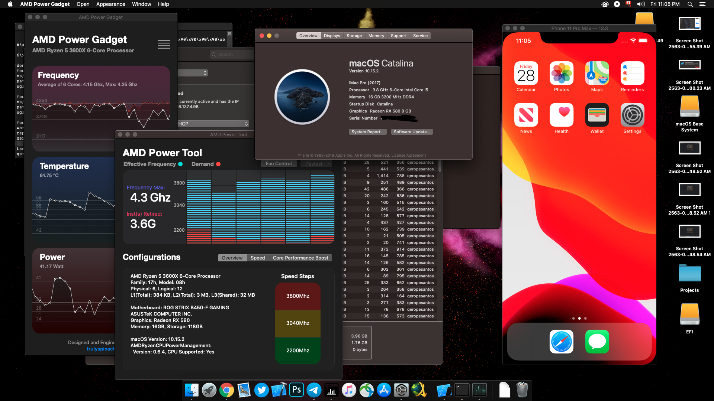

# Asus Rog Strix B450-F Hackintosh

<h3>
OpenCore 0.6.5 Configuration for Asus Rog Strix B450-F Motherboard Ryzen 1000-2000-3000-5000
</h3>
<h4>
  Currently tested versions:
  macOS Mojave, Catalina, BigSur
</h4>
<h5>
  <table>
  <tr>
  My Configuration:
    <th>
      AMD Ryzen 3600x
    <th>
      MSI Armor OC RX580
    <th>
      Teamgroup Delta 16GB 3200MHz
    <th>
      Silicon Power Sata 128GB SSD
  </table>
<h5>
  <table>
  <tr>
  Working:
  <th>
    Audio
  <th>
    Graphics
  <th>
    AMD Power Gadget
  <th>
    Xcode Emulation (Except Apple Watch)
  <th>
    Ethernet Connection
  <th>
    NVMe and Sata Drives
  </tr>
  </table>
<h5>
  <table>
  <tr>
  Not Working:
  <th>
    Wireless Connectivity
  <th>
    Front USB Ports (partially working)
  <th>
    Red USB Ports (partially working)
  </table>

<h5>
  Change "MLB" (Main Board Serial Number), "SerialNumber" and "UUID" with another one using "genSMBIOS" tool 
  This configuration can also be used with B450i Motherboard from Asus (Audio pci root should be modified)
