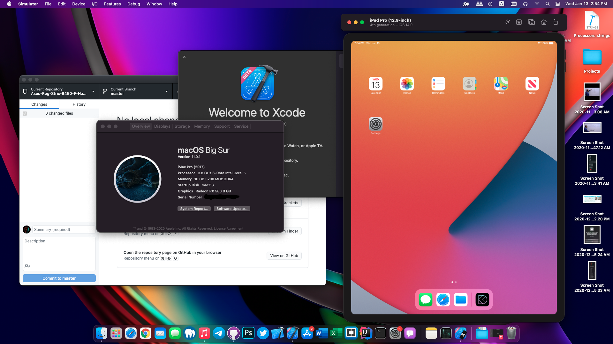

# Asus Rog Strix B450-F Hackintosh

<h3>
OpenCore 0.6.5 Configuration for Asus Rog Strix B450-F Motherboard Ryzen 1000-2000-3000-5000
</h3>
<h4>
  Tested:
  macOS Mojave, Catalina, BigSur
   
  * I did not bother to update the config to for macOS Monterey as there are stability problems with the on-board ethernet.
  <a href="https://github.com/donatengit/AppleIGB">probable fix</a> 
  * macOS Mojave may need some additional work.
</h4>
<h5>
  <table>
  <tr>
  My Configuration:
    <th>
      Rog B450-F
    <th>
      Ryzen 3600x
    <th>
      MSI RX588
  </table>
<h5>
  <table>
  <tr>
  Working:
  <th>
    Audio
  <th>
    Graphics
  <th>
    AMD Power Gadget
  <th>
    Xcode Emulation (Except Apple Watch)
  <th>
    Ethernet Connection
  <th>
    NVMe and Sata Drives
  <th>
    Almost Everything...
  </tr>
  </table>

<h5>
  Change "MLB" (Main Board Serial Number), "SerialNumber" and "UUID" with another one using "genSMBIOS" tool 
  This configuration can also be used with B450i Motherboard from Asus (Audio pci root should be modified)
